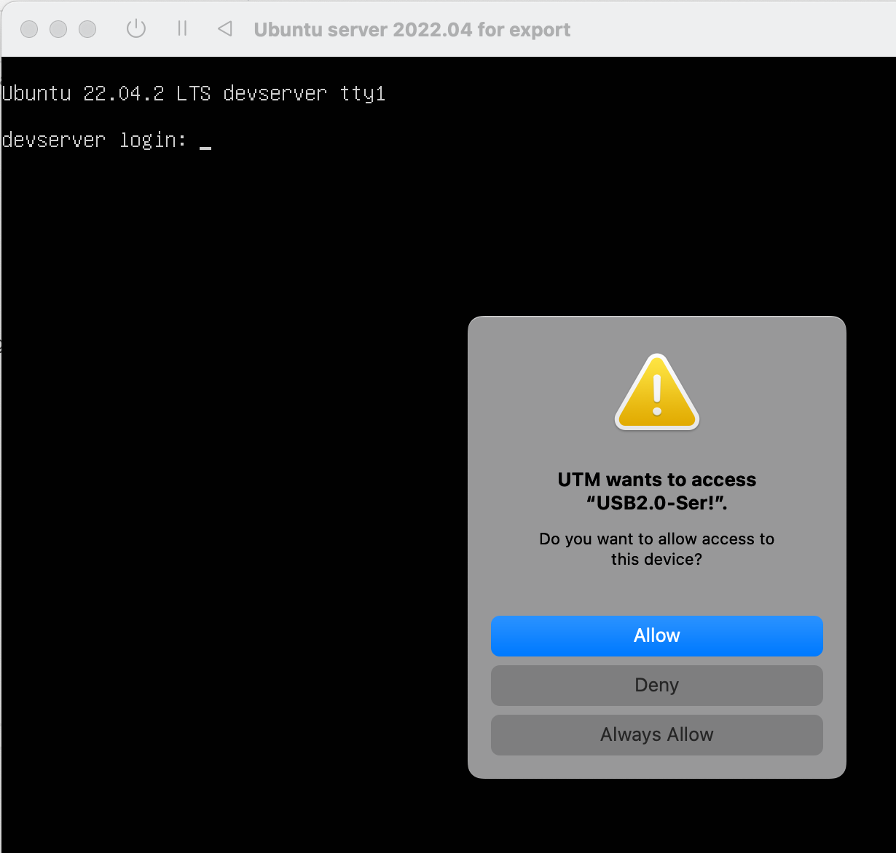
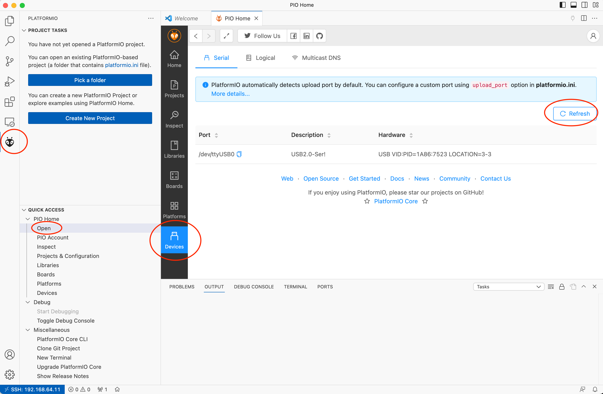

# Setting up an Ubuntu server for remove hardware development using Platform.io
This README provides the instruction on how to setup Visual Studio Code remote development via SSH on an Ubuntu server machine. The instruction are for UTM for Apple Silicon.

I also cover the installation of Ubuntu on UTM, because it requires a serial device. Without that, the installer kept crashing.

## Table of Content

1. [Why this guide](#why-this-guide)
2. [Ubuntu installation: UTM on MacOS Apple silicon](#ubuntu-installation-utm-on-macos-apple-silicon)
3. [Ubuntu OS configuration](#ubuntu-os-configuration)
4. [Use Visual Studio Code for remove development via SSH](#use-visual-studio-code-for-remove-development-via-ssh)
5. [Configure PlatformIO to work remotely](#configure-platformio-to-work-remotely)
6. [Connect your hardware board the the Virtual Machine](#connect-your-hardware-board-the-the-virtual-machine)
7. [Check if everything is working](#check-if-everything-is-working)

## Why this guide

I was trying to use a Arduino Uno clone [AZ-ATmega328] ([https://www.az-delivery.de/en/products/mikrocontroller-board](https://www.az-delivery.de/en/products/mikrocontroller-board)) that has a `ch341 usb-serial chip`. MacOS does not come with the driver for this chip (it gets detected, but it does not work reliably).
I also understood that some ch341 might work, if the manufacturer has provided the driver to Apple and the driver is signed (read online without proof).

However, to avoid installing untrusted kernel extentions on MacOS to have the ch341 wokring, I decided to do it on Ubuntu, since the chip is supported out-of-the-box.

## Ubuntu installation: UTM on MacOS Apple silicon
0. Install UTM virtualization software for Apple Silicon [https://mac.getutm.app/](https://mac.getutm.app/)
1. Download the Ubuntu server arm64 image here [https://ubuntu.com/download/server/arm](https://ubuntu.com/download/server/arm)
2. Create a new virtual machine
    1. Add new VM
    2. Select _Virtualise_
    3. Add the Ubunu image as boot image.
3. __Before starting the VM__, add a serial device:
    1. Right click on the VM you just created
    2. Select _Edit_
    3. On the left, under devices, click the _New_ button
    4. Add a Serial device

4. Start the VM
5. Proceed with the installation.

    __IMPORTANT__: Use the __serial__ monitor to install the OS. In the serial monitor, select __basic__ installation. Not using the serial monitor might make the installer on video output crash.
6. When the installation is complete, the installer asks you to reboot. __DO NOT REBOOT__: Just shut down the machine.
7. After shutting down the machine, go to settings (right-click on the VM > Edit):
8. Remove the __serial__ device:

9. Remove the __USB Drive__ device:

10. Start the VM

## Ubuntu OS configuration
1. add the user to the dialup config

    `sudo usermod -a -G dialout $USER`
2. Reboot the VM
3. Install your public SSH key into .ssh/authorized_keys
4. _Optional_: set the server IP as static

## Use Visual Studio Code for remove development via SSH

1. Install Visual Studio Code on your client machine [link](https://code.visualstudio.com/Download)
2. We are going to leverage the Visual Studio Code remove development cabapilities (over SSH, not the GitHub tunnel)
[https://code.visualstudio.com/docs/remote/ssh-tutorial](https://code.visualstudio.com/docs/remote/ssh-tutorial)

3. Install the VS Code _Remote - SSH Extension_:
[Direct VS Code Extension link](vscode:extension/ms-vscode-remote.remote-ssh)

4. Click to the connect icon in the bottm left of VS Code:

5. In the command windows that opens up, select _connect to host_:

5. Select _Add New SSH Host_:

6. Insert the connection string. Note: if you want to use SSH keys, you need to have that copied in the ~/.ssh/ path. 

    Also you need the `-A` param to forward the keys.

    __Alternative__: you can connect every time using SSH user and password

    To use password, the connection string is:
    `ssh -o IdentitiesOnly=yes ubuntu@<your_server_IP>`

7. Connect to the remote server
8. Install PlatformIO extention on the __remote server__:

9.Reboot the VM

## Configure PlatformIO to work remotely

Connect again to the remote dev tunnel (step 4-7)
__Important__: In order to have PlatformIO working remotely, we need to amend fix the PlatformIO server PORT and add a forward rule to the __ssh__ settings:
1. Adjust PlatformIO server port:
    1. Go to VS Code settings:
    
    2. Select the _remote settings_ for your remote connection
    3. Select _Extension >PlatformIO IDE_ on the left plane:
    4. Set the PlatformIO PORT to 8008
    
    5. Close the VS Code with the remote connection
2. Adjust the SSH configuration adding a local port forward rule. 

    Edit the `.ssh/config` file for your server IP as shown below, adding the `LocalForward 127.0.0.1:8008 127.0.0.1:8008` rule.

Your .ssh/config entry sould look like this (for password auth):

        ```Host <your_server_IP>
        HostName <your_server_IP>
        IdentitiesOnly yes
        User ubuntu
        LocalForward 127.0.0.1:8008 127.0.0.1:8008```

## Connect your hardware board the the Virtual Machine

1. Keep the VM Windows selected in foreground
2. Connect the USB cable
3. Accept the UTM permission to connect the USB to the VM
    
4. Accept MacOS USB connection permission
    

## Check if everything is working
1. Go to your remote session of VS Code
2. Check the PlatformIO device menu

3. You should be able to see the development board (e.g., Arduino) in your device list.